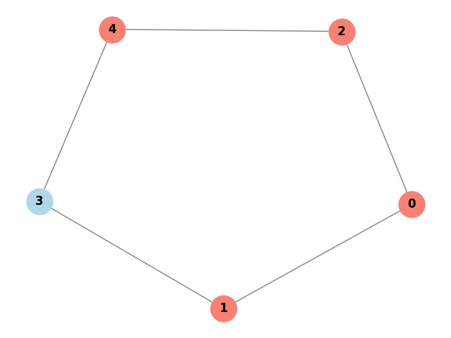

# Prioritizing Patch Management for Cybersecurity using Quantum-Inspired Vertex Cover Algorithm

Team:
- Alli Ajagbe
- Ayush Sheth

This is the README file for the project as well as the repo.

For checkpoint 1:

- We are addressing the literature review done already for the further creation and implementation of the project.
- The literature repo is the `Quantum Computing Project Literature Reviews` file here.
- The `description.md` file under `LearningMaterials` contains descriptions and details, in brief, about the learnings and meanings of the requisite for the project. Going through them will provide ample background about Patch Management, Vertex Cover Algorithm, and how Quantum Computing makes up this project.
- The progress report (in one-liner texts) is also added as progress.txt
- We have implemented vertex cover (in the `VertexCover` folder) and bipartite graph representation (in the `BipartiteGraph` folder) under the `LearningMaterials` folder.

From our Vertex Cover Implementation:
Given the Graph             |  Vertex Cover
:-------------------------:|:-------------------------:
  |  
